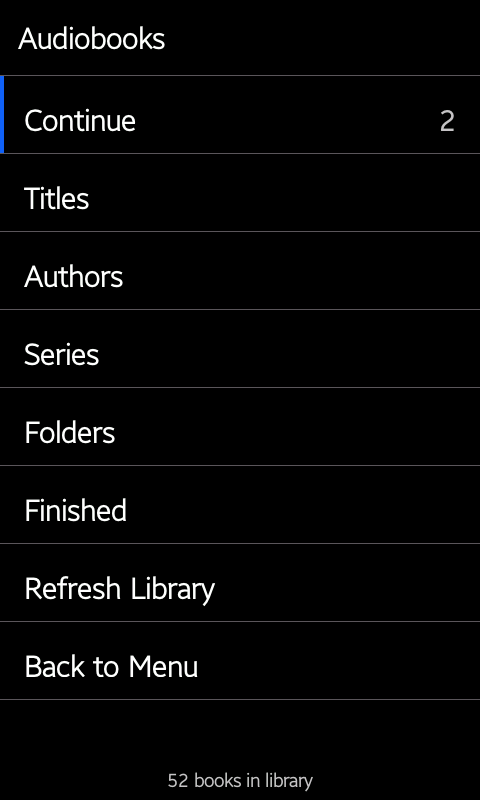
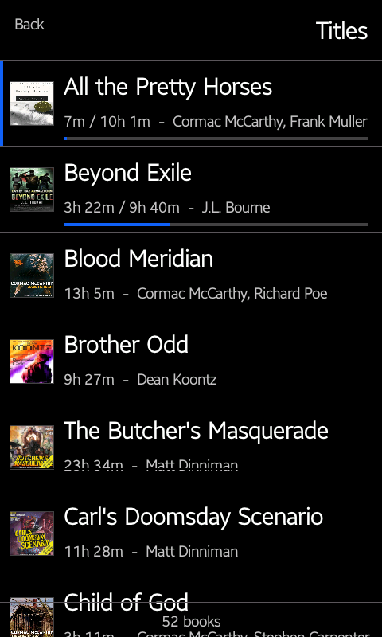
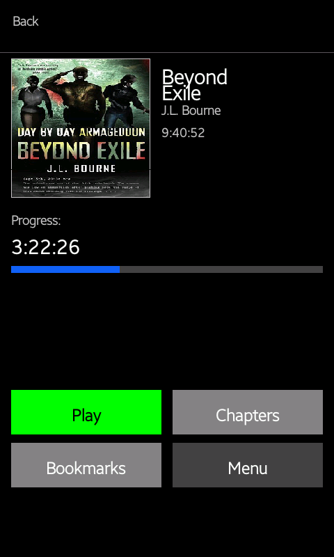
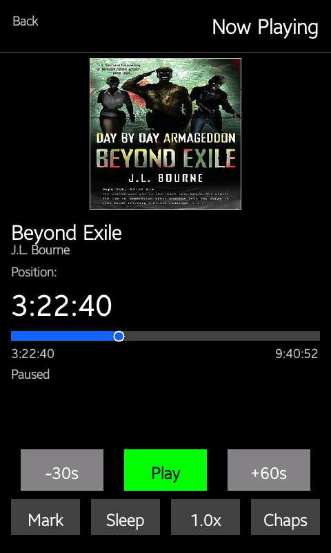
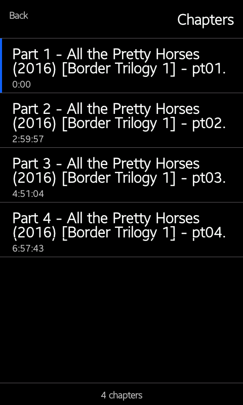
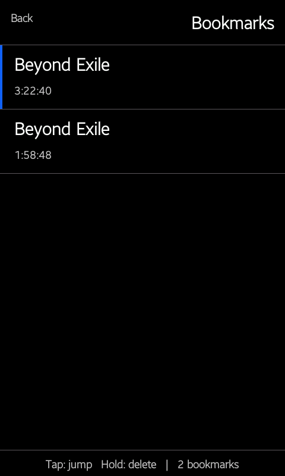
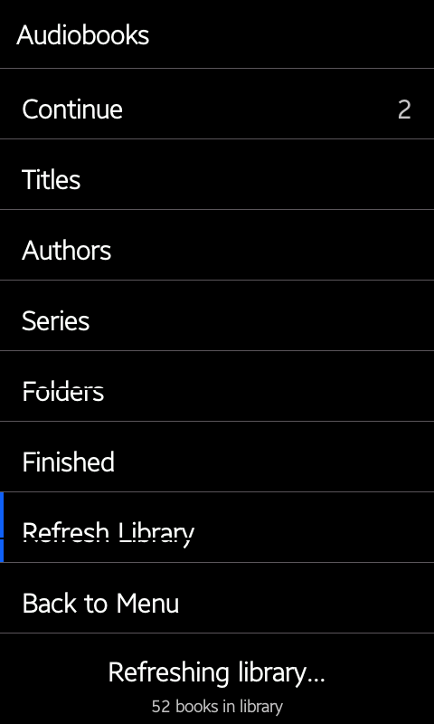
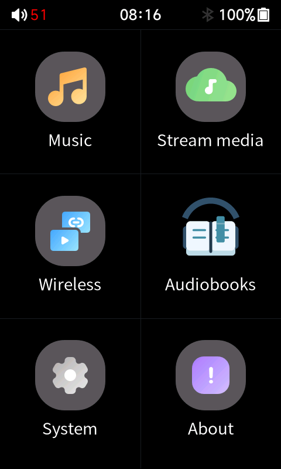

# HiBy R1 Audiobook Firmware

A self-contained audiobook app for the normal HiBy R1, based on stock HiBy R1
firmware 1.6. **Not for the R1 MIDI.**

> **v2.0.23 is the current release.** It adds an app-scoped SD-card
> runtime-power guard after an overnight freeze was traced to the stock Ingenic
> MMC driver, and reduces resume-write traffic while keeping exact saves on
> pause, stop, completion, and app exit. It includes all v2.0.22 hardware-key,
> volume, Bluetooth, library, and playback improvements.

## Current release

- **Version marker:** `2.0.23`
- **About-screen label:** `HiBy R1 2.0.23`
- **Download:** <https://github.com/yetisoldier/Hiby-R1-Audiobook-Mod/releases/tag/v2.0.23>
- **Package:** `r1-audiobooks-2.0.23.upt` (rename to `r1.upt` to install)
- **UPT MD5:** `11ddcf7e8d93eefc1038662d4d324830`
- **UPT SHA256:** `c366a2b5a78a7943b20fab619a8e20d26c61d17f374dab66e34436f99f40f653`
- **Boot ADB:** included (installs `/etc/init.d/S90adb`). ADB is available at
 boot whenever System → USB working mode is set to **Device** (mode 1). ADB and
 USB-DAC share the single USB gadget controller and are mutually exclusive by
 USB working mode, so this does not block USB-DAC (set the mode to DAC and ADB
 stays off that session). Drop `-EnableBootAdb` from the build for a no-ADB
 variant.
- **Restored stock unlocks:** USB DAC mode, Native DSD (analog), and Bluetooth
 SBC XQ - the three general device/music unlocks the v1.5.0-v1.6.3 line carried,
 re-enabled on the 2.0.x build via `-UnlockNativeDsd -EnableBluetoothSbcXq
 -UnlockUsbDacMode`. No audiobook code changed.
- **Base firmware:** stock HiBy R1 1.6 (normal R1).

**v2.0.20 compatibility note:** v2.0.20 was published from an experimental
UTF-8/Cyrillic side branch. That text-rendering experiment is not included in
v2.0.23 because this release follows the separately tested stability line. If
you rely on Cyrillic audiobook names or tags, remain on v2.0.20 for now.

Before flashing, keep a known-good stock 1.6 `r1.upt` for recovery. This is
unofficial firmware tested on one personal normal HiBy R1. Reinstalling stock
firmware should reverse it, but use it at your own risk. Do not install it on
the R1 MIDI or other HiBy players unless you are prepared to recover the device.

## Screenshots

<p>
 
 
 
 
</p>
<p>
 
 
 
 
</p>

Captured directly from the test R1 running v2.0.23. Full set in
[`docs/screenshots/`](docs/screenshots/).

## How it works

The audiobook app runs **in-process** inside `hiby_player`:

- A small `LD_PRELOAD` library (`audiobook_app/hook.c`) installs a trampoline on
 the launcher's Audiobooks tile callback. Tapping the tile runs our app instead
 of the stock cave code.
- An `ioctl` hook intercepts `FBIOPAN_DISPLAY` and draws our UI to the target
 framebuffer buffer *before* each pan. This keeps HiBy's display loop (and the
 touch controller) alive while showing our UI.
- The event loop reads touch and the hardware keys, and the player engine
 decodes MP3 / M4B and writes PCM to ALSA (wired) or BlueALSA (Bluetooth A2DP),
 falling back to wired when no BT sink is connected.
- Exiting the app clears the framebuffer and returns immediately so the HiBy
 launcher redraws cleanly.

The app and its UI, player, library scanner, and chapter/bookmark storage live
in `audiobook_app/` and a tiny native helper. The stock Music player, file
browser, Bluetooth, USB, and system UI are otherwise untouched.

## Features

**Library**
- Home menu: Continue, Titles, Authors, Series, Folders, Finished, Refresh.
- Folders follows the real `/Audiobooks` directory hierarchy instead of showing
  a flattened list.
- Refresh Library runs in the background with visible progress, so playback,
  touch, and hardware controls remain responsive during a scan.
- Scrollable list views with **cover-art thumbnails** — JPEG via `dlopen`'d
 libjpeg and PNG via a self-contained streaming decoder over `dlopen`'d `libz`,
 decode-on-demand with a progressive-JPEG guard so huge covers bail gracefully
 instead of OOM-freezing.
- Swipe left from a list -> Now Playing.

**Playback**
- **MP3** and **M4B/AAC** (AAC via the device's `libfdk-aac`, `dlopen`'d).
- **Per-book + multipart resume** across reboots and book switching, with a
 5-second smart rewind on resume. Positions are **SD-primary** (one tiny file
 per book on the SD card) so they survive even a full internal data partition;
 the SQLite DB is a best-effort mirror. Playing positions checkpoint every 15
 seconds, the DB mirror is limited to once per minute, and the exact position is
 saved immediately on pause, stop, completion, and app exit. A book must play
 for at least 15 seconds before its first periodic checkpoint.
- **Now Playing**: cover art, title/author/duration, and a **draggable progress
 handle** (scrub seek; tapping the bar elsewhere does not jump).
- **Playback speed** 1.0 / 1.1 / 1.25 / 1.5 / 2.0x via **WSOLA time-stretch**
 (pitch preserved; 1.0x exact passthrough). Persists.
- Now Playing Prev/Next rewind 30 seconds and advance 60 seconds, clamped to
  the beginning/end of the book.
- **Sleep timer** Off / 15 / 30 / 60 min with live countdown; auto-pauses and
 saves on expiry.
- **M4B chapters** parsed from the embedded QuickTime chapter track (stsc-aware)
 or Nero `chpl`; MP3 books get one chapter per file. Tap a chapter to seek.
- **Bookmarks**: tap **Mark** on Now Playing to add; tap to jump; long-press to
 delete. Bookmarks are **SD-primary** — one tiny `<book_id>.bm` file per book on
 the SD card, written atomically (temp then rename) so a power cut cannot
 corrupt an existing set. A full internal data partition can never lose or
 refuse a bookmark, and existing in-DB bookmarks migrate to SD automatically
 the first time a book's bookmark screen is opened.
- **Bluetooth A2DP output**: streams to paired Bluetooth headphones/speakers
 (BlueALSA `pcm.bluealsa` plug, auto rate/format conversion), with AVRCP
 play/pause from the remote. Auto-detect at track open; falls back to the wired
 output automatically when no BT sink is connected or the transport drops
 mid-playback (retry-then-fallback, no auto-switch-back until the next track
  open). Bluetooth mixer state is retried and tracked separately from wired
  volume to prevent startup and pause/resume volume jumps. On exit over BT the
  stock player is handed back **paused**, so music no longer auto-plays over the
  speaker when you leave the app.

**Hardware**
- Power button toggles backlight (audio keeps playing dark; double-tap wakes).
- Play/pause, prev/next, volume keys in-app. Volume is fine-stepped (~2-2.5 dB)
  with hold-to-ramp and a temporary on-screen volume indicator.
- Rapid button presses are queued in order instead of overwriting one another.
- Back is always top-left on every in-app screen.

**ADB (since v2.0.15)**
- ADB is available at boot when USB working mode is set to **Device**, via the
 `S90adb` init script baked into the rootfs. No in-app toggle needed. ADB and
 USB-DAC are mutually exclusive by USB working mode.

**SD-card stability (since v2.0.23)**
- While Audiobooks is open, the app keeps the removable-card platform, host,
  and card runtime-power controls active. This avoids the stock Ingenic X1600
  MMC driver's rapid three-second suspend/resume cycle while the app is reading
  media and writing resume data.
- Leaving Audiobooks restores each control to its previous value, normally
  `auto`, so the SD card can suspend normally in the stock launcher and Music
  player. There is no always-running daemon and no global power-management
  change.
- A lightweight 30-second health check only logs repeated missing MMC-worker or
  non-active runtime states. It never reboots the device.

**Restored stock unlocks (since v2.0.17)**
- These three general device/music unlocks were carried by every pre-2.0 release
 (v1.5.0-v1.6.3) and were dropped at the v2.0.0 NativeApp pivot; v2.0.17 turns
 them back on. They are pure stock-resource / shell-config tweaks (no binary,
 boot, PMIC, or mount changes), so the audiobook app and hook are unchanged from
 v2.0.16.
- **USB DAC mode**: unlocks the USB-DAC working mode and related Settings flags,
 so you can set System -> USB working mode to **DAC** and use the R1 as a USB
 DAC. USB-DAC and boot-ADB share the single USB gadget controller and stay
 mutually exclusive by USB working mode (Device = ADB on; DAC = USB audio out,
 ADB off that session) - complementary to boot-ADB, not a conflict.
- **Native DSD**: sets `AnalogDsdNative: native` on the analog output device in
 `ot_devices.json`, enabling native DSD on the analog output path for the stock
 Music player (was `dop`).
- **Bluetooth SBC XQ**: adds `--sbc-quality=xq` to the BlueALSA launch in
 `/usr/bin/bt_init`, raising SBC encoding quality when the receiving device
 supports it. Because the audiobook app drives `pcm.bluealsa` directly for BT
 output, this applies to audiobook-over-BT as well as stock music.

## Expected behavior

- **First run with an SD card:** put audiobooks under `/Audiobooks`, open the
  Audiobooks tile, and tap **Refresh Library**. The screen shows a
  "Refreshing library..." banner, then a green confirmation flash. This
  scans `/Audiobooks`, builds the library DB, and caches chapters. Music under
  `/Music` is unaffected. The scan runs on a worker connection and does not
  block audiobook playback or controls.
- **Re-scanning after a chapter fix:** Refresh re-parses M4B chapters, so if a
 book showed only one chapter it will be replaced with the full list after a
 Refresh.
- **Large libraries:** the M4B chapter parser memory-maps the `moov` atom
 instead of loading it into RAM, so books with large (15 MB+) `moov` atoms no
 longer run out of memory and freeze the scan.
- **Storage-full guard:** if the internal data partition has too little free
 space to write the library DB, the scan aborts cleanly with a red on-screen
 error flash instead of stalling. (The internal partition is chronically near
  full because the stock music database rebuilds on every boot.)
- **SD-card interruption guard:** a read failure or unavailable audiobook path
  stops playback without marking the book complete or overwriting its saved
  position.
- **Resume persistence:** periodic position files are written every 15 seconds.
  Pause, stop, completion, and app exit save immediately. The less-frequent
  SQLite mirror is only for list progress and does not control the authoritative
  resume position.
- **Leaving the app:** when you swipe or back out of the Audiobooks app to the
 HiBy launcher, **audiobook playback stops**. Audio is tied to the app being
 open. Exiting while playing returns cleanly to the launcher (no black screen,
 no power-button kick needed). Background playback on the launcher is a
 planned future improvement, not in this release.
- **Resume:** opening a book you were listening to resumes near your last
 position, rewound 5 seconds. Bookmark and chapter jumps go to the exact
 saved timestamp.

## Install

1. Download `r1-audiobooks-2.0.23.upt` from the release page.
2. Rename it to exactly `r1.upt` (the R1 will not recognize the update otherwise).
3. Copy it to the root of the SD card.
4. On the R1, run the normal firmware update
   (System -> Firmware update -> Via SD-card).
5. Wait for success and the reboot.
6. After boot, delete or rename `r1.upt` on the SD card so the updater stops
 offering it.
7. Open the Audiobooks tile and tap **Refresh** to scan `/Audiobooks`.

Recommended SD-card layout:

```text
/Music
/Audiobooks/Author/Year - Book Title/01 - Chapter.mp3
/Audiobooks/Author/Year - Book Title/Book Title.m4b
```

Metadata that helps: Album = book title, Title = chapter/file title,
Album artist = author, and numbered files for multipart books. The app derives
fallbacks from folders/filenames when tags are missing. The genre tag does not
need to be `Audiobook` - anything under `/Audiobooks` is treated as one. External
cover art is picked up from `cover.jpg` / `cover.png` / `cover.jpeg` /
`folder.jpg` / `folder.png` in the book folder; otherwise the embedded MP3 APIC
or M4B `covr` art is used.

## Building from source

The firmware is built offline from the extracted stock 1.6 rootfs plus the
audiobook app. The audiobook app (`audiobook_app/`) is cross-compiled to MIPS32
with `zig cc` (target `mipsel-linux-gnueabihf.2.22`).

Build the hook/app shared library:

```powershell
powershell -NoProfile -ExecutionPolicy Bypass -File tools\build_r1_audiobook_hook.ps1
```

Build the public-release firmware (version 2.0.23):

```powershell
powershell -NoProfile -ExecutionPolicy Bypass -File tools\build_r1_audiobook_firmware.ps1 `
 -OutDir work\audiobook-firmware-2.0.23 `
 -OutputUpt work\audiobook-firmware-2.0.23\r1-audiobooks-2.0.23.upt `
 -IncludeAudiobookNativeApp `
 -IncludeAudiobookLauncherIcon `
 -EnableBootAdb `
 -UnlockNativeDsd `
 -EnableBluetoothSbcXq `
 -UnlockUsbDacMode `
 -CustomVersionId 2.0.23 `
 -CustomVersionLabel "HiBy R1 2.0.23"
```

`-EnableBootAdb` installs `/etc/init.d/S90adb` so ADB starts automatically after
every boot. The v2.0.23 public release ships with it on; drop the flag for a
build without persistent ADB. `-UnlockNativeDsd`, `-EnableBluetoothSbcXq`, and
`-UnlockUsbDacMode` restore the three general device/music unlocks the pre-2.0
line carried (Native DSD on the analog path, BlueALSA SBC XQ, and the USB DAC
working mode). They are independent of the NativeApp pivot and combine cleanly
with it.

The NativeApp build is mutually exclusive with the legacy resume-daemon
switches (`-IncludeAudiobookLauncherGenre`, `-IncludeAudiobookResumeRuntime`,
`-IncludeAudiobookDbMaintenance`, etc.) - use `-IncludeAudiobookNativeApp`
alone.

## Architecture and docs

- `docs/modding/` - **modder knowledge base**: the reverse-engineering
 reference for the hook architecture, flash/recovery flow, audio decode/ALSA,
 Bluetooth A2DP/AVRCP, input keys, cover art, WSOLA/seek, library scan/storage,
 SD runtime-power stability, ADB automation, and the brick-lessons/build-risk
 guide. Start at
 `docs/modding/README.md`.
- `docs/audiobook_firmware_architecture.md` - high-level firmware architecture
 (NativeApp pivot).
- `docs/build_flash_verify_runbook.md` - build, flash, and verify runbook.
- `docs/adb_control_tools.md` - live ADB control (screenshots, taps, presets).
- `docs/github_release_process.md` - GitHub Release publishing runbook.
- `docs/production_release_checklist.md` - release and verification checklist.
- `docs/modder_start_here.md` - orientation for modders (points into
 `docs/modding/`).
- `docs/audiobook_app_feature_reference.md` - historical feature map (carries a
 superseded banner; top section reflects the NativeApp).
- `docs/screenshots/` - README screenshots.
- `firmware/releases/v2.0.16/` - v2.0.16 release notes and checksums.
- `firmware/releases/v2.0.17/` - v2.0.17 release notes and checksums.
- `firmware/releases/v2.0.23/` - current release notes and checksums.
- `CHANGELOG.md` - release history.

## Attribution and sources

This project is unofficial and not affiliated with or endorsed by HiBy. HiBy,
HiBy R1, and the stock firmware remain HiBy's work.

Information and techniques used while building this mod came from:

- [HiBy R1 User Manual](https://guide.hiby.com/en/docs/products/audio_player/hiby_r1/guide)
- [HiBy R1 firmware 1.6 update page](https://store.hiby.com/apps/help-center#hc-r1-firmware-v16-update)
- [Rockbox HiBy Port wiki](https://www.rockbox.org/wiki/HibyPort)
- [bidhata/Hiby-R1-Mod](https://github.com/bidhata/Hiby-R1-Mod)
- [SuperTaiyaki/hiby-firmware-tools](https://github.com/SuperTaiyaki/hiby-firmware-tools)
- [hiby-modding/hiby-mods](https://github.com/hiby-modding/hiby-mods)
- [hiby-modding/hiby_os_crack](https://github.com/hiby-modding/hiby_os_crack)
- [seanap/Plex-Audiobook-Guide](https://github.com/seanap/Plex-Audiobook-Guide)

The audiobook-specific behavior was developed and tested on a personal normal
HiBy R1 through local reverse engineering, live ADB testing, and repeated
stock-firmware recovery tests.
