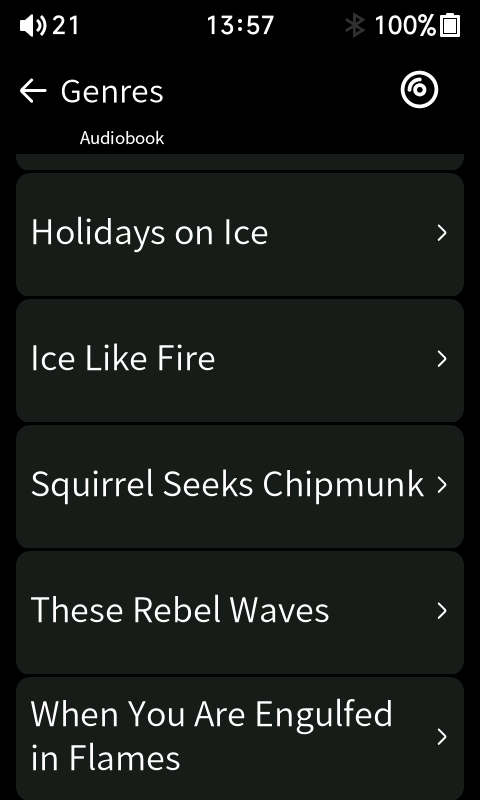

# HiBy R1 Audiobook Firmware Workspace

This workspace is for investigating and prototyping audiobook support on the HiBy R1 without taking unnecessary flashing risks.

## Release Build Quick Guide

Current shareable package:

- Version marker: `1.6.4-audiobook`
- Download page: <https://github.com/yetisoldier/Hiby-R1-Audiobook-Mod/releases/tag/v1.0.0>
- Package: `r1-audiobooks-1.6.4-audiobook.upt`
- UPT MD5: `71c8d0d94bf50529a06aa9a31350f595`
- UPT SHA256: `02b286676d93ec683307820e1ef40288f34ef21a42a24f5cbda361f2d3733b7b`
- Base firmware: stock HiBy R1 1.6 for the normal R1, not the R1 MIDI

Before flashing, keep a known-good stock 1.6 `r1.upt` available for recovery. This mod has only been tested on one normal HiBy R1. Reinstalling stock firmware should reverse it, but it is still unofficial firmware, so use it at your own risk. Do not use it on the R1 MIDI or other HiBy players unless you are prepared to recover the device yourself.

## Screenshots

<p>
  
  
</p>

## Install The Build

The R1 updater expects the firmware file at the SD-card root as `r1.upt`.

Manual install:

1. Download `r1-audiobooks-1.6.4-audiobook.upt` from the release page.
2. Rename the copied file to exactly `r1.upt`. This is important; the R1 will not recognize the update otherwise.
3. Safely eject/remount the SD card if you copied it outside the player.
4. On the R1, run the normal firmware update from the device UI.
5. Wait for the update to report success and reboot.
6. After a successful boot, delete or rename SD-root `r1.upt` so the updater does not keep offering the same update.
7. On the R1, go into Music and run `Update Database`, then wait for the scan to complete.

ADB-assisted install from this workspace:

```powershell
python tools\verify_r1_audiobook_build.py --require-db-maintenance --expect-current-hashes

powershell -NoProfile -ExecutionPolicy Bypass -File tools\adb_stage_verified_firmware.ps1 `
  -ExpectCurrentHashes `
  -IUnderstandThisStagesFirmware
```

Then run the updater from the R1 UI. The staging script verifies the local package, refuses known bad packages, pushes the file as `/usr/data/mnt/sd_0/r1.upt`, and checks the remote byte count plus hashes when available.

## What Changes From Stock

From a UI and day-to-day use perspective:

- The main launcher label `Books` is renamed to `Audiobooks`.
- Opening `Audiobooks` goes directly to an audiobook book-title list instead of the old text-book menu.
- Tapping a book title starts playback through the stock audio player path and switches to the Now Playing screen.
- The firmware remembers a separate resume point for each audiobook, including multipart books, across listening to music and across reboots.
- If a multipart book resumes from a later file, the runtime attempts to select the saved file and seek to the saved position.
- If playback reaches within 45 seconds of the end of the whole book, the book is treated as completed; the next title tap starts it from the beginning.
- Audiobook files are kept out of normal Music Albums, Genres, and Search catalog tables.
- Folder browsing still works, so files under `/Audiobooks` can still be found through file/explorer style views.
- The old text-file Books/TXT reader launcher flow is replaced by Audiobooks.
- The About/version strings show the custom build, although the R1 UI may truncate the visible suffix to something like `1.6.4-a`.

The stock Music player behavior is otherwise intentionally preserved: normal music playback, Now Playing, progress bar, physical controls, and the file explorer remain stock-style.

## Folder And Metadata Expectations

For the shareable on-device flow, use these SD-card folders:

```text
/Music
/Audiobooks
```

Recommended music layout:

```text
/Music/Artist/Album/01 - Track.flac
```

Recommended audiobook layout:

```text
/Audiobooks/Author/Year - Book Title/01 - Chapter.mp3
/Audiobooks/Author/Year - Book Title/02 - Chapter.mp3
```

Single-file books such as `.m4b` files are fine:

```text
/Audiobooks/Author/Year - Book Title/Book Title.m4b
```

Metadata expectations:

- `TALB` / Album should be the book title.
- `TIT2` / Title should be the chapter or file display title.
- `TPE2` / Album Artist should be the author.
- `TPE1` / Artist may be author, narrator, or both.
- `TCOM` / Composer may be narrator.
- Track numbers or numbered filenames are strongly recommended for multipart books.

The firmware does not require perfect audiobook tags. If metadata is missing, the on-device helper derives basic author, book title, chapter/title, and order from folder and filename structure. Better tags and numbered files make the book list and multipart resume more reliable. MP3Tag works well for this; the Seanap/Plex-style convention, with album as the book title and album artist as the author, is a good fit.

For best results, especially if you want future series support, this folder
shape is recommended but not required:

```text
/Audiobooks/Author/Series/2020 - Book Title [Series 02]/01 - Chapter.mp3
/Audiobooks/Author/2021 - Standalone Book/01 - Chapter.mp3
```

The second form intentionally has no series folder. The catalog leaves its
series fields blank, so standalone books are not forced into a fake series.

## After Installing

After the first boot into the custom firmware:

1. Remove or rename SD-root `r1.upt`.
2. Put music under `/Music` and audiobooks under `/Audiobooks`.
3. Run the normal on-device Music scan/update.
4. Wait about a minute for the audiobook DB watcher, or reboot once.
5. Open `Audiobooks` from the main launcher.
6. Confirm book titles appear and a title tap starts playback on the Now Playing screen.
7. Confirm normal Music Albums and Genres do not list audiobooks.

If ADB is enabled for verification, it still has to be enabled manually after reboot on the test device. Optional installed-release verification:

```powershell
powershell -NoProfile -ExecutionPolicy Bypass -File tools\adb_verify_installed_audiobook_release.ps1 `
  -CaptureFramebuffer
```

If the media database is missing or empty, the firmware can seed a valid empty DB schema and scan `/Music` plus `/Audiobooks` itself. If the stock scanner already created music rows, the helper preserves those music rows and refreshes only audiobook rows and catalog tables.

## Known Quirks And Odd Behavior

- Back navigation from the Audiobooks title list is not perfectly custom: pressing Back once lands on the stock Genres page, and pressing Back again returns to the launcher.
- Title selection can take a second or two. Multipart resume may briefly show the track list or advance through tracks while it lands on the saved file and position.
- There is currently no audiobook search UI; browse by scrolling through the title list.
- The old TXT reader is no longer available from the launcher because the Books section is repurposed as Audiobooks.
- The visible About screen version is truncated by the stock UI, even though `/etc/r1_audiobook_version` and `/usr/resource/config.json` contain the full `1.6.4-audiobook` marker.
- ADB does not persist in practice on the test R1; it must be manually re-enabled after reboot or update.
- The DB helper provides practical fallback metadata but is not a full audiobook tag parser. Clean folder structure and numbered multipart files matter.
- If the SD card is replaced, the player should still boot and Music should still work. Run the on-device Music scan/update and wait or reboot so the watcher can rebuild catalogs for the new card.
- Existing per-book resume records are stored internally under `/usr/data/audiobooks/resume.d`. They are small and survive SD-card replacement, but a resume record may not match a different card's renamed or reorganized audiobook files.
- Development builds after `1.6.4-audiobook` use lower-power idle polling for the resume daemon while normal music or non-audiobook content is active. The stable `1.6.4-audiobook` release polls more aggressively, which can have a small battery and responsiveness cost during normal music playback.
- If an update ever boots to a black screen, use the normal R1 flash/recovery flow with a stock 1.6 `r1.upt`.

## Current Status

The current shareable candidate is `1.6.4-audiobook`. It is still based on stock HiBy R1 firmware 1.6 for the normal R1, not the R1 MIDI, but it no longer requires a PC/ADB database install for normal use.

Shareable SD-card workflow:

1. Put music under `/Music`.
2. Put audiobook files under `/Audiobooks`.
3. Run the normal on-device Music scan/update.
4. Wait about a minute, or reboot once, then open `Audiobooks`.

The stock scanner can still build the base media database. A firmware-installed watcher waits for the DB to settle, then runs a static MIPS helper on-device. If `/usr/data/usrlocal_media.db` is missing or empty, the watcher first copies an embedded seed schema and the helper scans `/Music` plus `/Audiobooks` itself. If the stock DB already has music rows, the helper preserves them and only refreshes audiobook rows. It derives reasonable fallback metadata from folders and filenames when needed, writes `/usr/data/audiobooks/catalog.tsv`, and rebuilds normal Music catalog/search/count tables without audiobook album/genre/search leakage. If there is no SD card, the watcher skips scan work and the player still boots normally. If the SD card is replaced, the next scan/watch pass rebuilds from that card.

Local verified package:

- UPT: `work\audiobook-firmware-1.6.4\r1-audiobooks-1.6.4-audiobook.upt`
- UPT MD5: `71c8d0d94bf50529a06aa9a31350f595`
- UPT SHA256: `02b286676d93ec683307820e1ef40288f34ef21a42a24f5cbda361f2d3733b7b`
- Rootfs MD5: `2d88686810d7b6782b56386776af7a52`
- Rootfs SHA256: `2da94366031bdaeac8c0908fccf3988d29e4296ed10776c54b5cd2504e88d3da`
- Player MD5 inside rootfs: `09997a636c94112ff76c85a6d4a8d0ff`
- Helper SHA256: `de40a30fda504366a137f4c6fa57670d05039108355c7f85a4a6199c7d280377`
- Seed DB MD5: `7dc472d4d9d086d22efbff24ab2fce13`

Verified locally on 2026-06-10 with:

```powershell
python tools\verify_r1_audiobook_build.py --require-db-maintenance --expect-current-hashes
```

For development builds after the WSL/QEMU setup, the real MIPS DB helper can
also be tested locally without flashing:

```powershell
powershell -NoProfile -ExecutionPolicy Bypass `
  -File tools\test_r1_db_maint_qemu_wsl.ps1 `
  -Helper work\native-db-maint\r1_audiobook_db_maint_enhanced
```

The resume daemon's multipart title-selection logic can also be tested locally:

```powershell
powershell -NoProfile -ExecutionPolicy Bypass `
  -File tools\test_r1_resume_daemon_logic_wsl.ps1
```

For live resume testing, `tools\adb_collect_audiobook_resume_debug.ps1` collects
the daemon logs, catalog, resume records, process/memory/kernel state, and
`user.ini` snapshot into `work\resume-debug\...` before a reboot clears useful
clues.

For battery or music-playback responsiveness checks, use the read-only runtime
monitor while the R1 is playing:

```powershell
powershell -NoProfile -ExecutionPolicy Bypass `
  -File tools\adb_monitor_r1_runtime.ps1 `
  -DurationMinutes 120 `
  -IntervalSeconds 60
```

It writes battery/sysfs, load, memory, process, current-path, and recent
audiobook logs to `work\runtime-monitor\...`.

For local development, this wrapper runs the fast parser, shell, Python,
resume-daemon, DB-helper, and diff checks we use before pushing:

```powershell
powershell -NoProfile -ExecutionPolicy Bypass `
  -File tools\run_local_dev_sanity.ps1
```

Author/Title/Series audiobook subviews are being researched in
`docs\audiobook_views_research.md`. The current release opens the Title view;
the route research tool can test alternate stock routes in RAM without flashing.

Live self-contained rebuild testing on 2026-06-10 passed before flashing `1.6.4`: after deleting the active DB/catalog, the updated watcher copied the embedded seed DB and the helper rebuilt 114 `/Music` rows plus 135 `/Audiobooks` rows entirely on-device. The pulled DB under `work\watcher-seed-rebuild-test-20260610-152923` had integrity `ok`, 249 rows in both playback tables, six audiobook books, zero audiobook rows in `SEARCH_TABLE`, zero album leaks, and no `Audiobook` genre. The `1.6.4` package was staged to `/usr/data/mnt/sd_0/r1.upt` with matching byte count, MD5, and SHA-256.

Post-flash verification on 2026-06-10 passed for `1.6.4-audiobook` with artifacts under `work\installed-release-verification\20260610-153805`: the installed device reports `1.6.4-audiobook`, the main launcher shows `Audiobooks`, the resume daemon and DB watcher are running, SD-root `r1.upt` was renamed to `/usr/data/mnt/sd_0/r1-audiobooks-1.6.4-audiobook-installed-20260610-1531.upt`, `user.ini` has no saved-last audiobook references, `/usr/data` has about 18.3 MB free, and the live DB/catalog release-state check passed with 135 audiobook rows in both playback tables and no Music album/genre/search leakage. The pulled installed DB also has 114 `/Music` rows and 135 `/Audiobooks` rows in both `MEDIA_TABLE` and `MEDIA2_TABLE`.

Previous post-flash verification on 2026-06-10 passed for `1.6.3-audiobook` with artifacts under `work\installed-release-verification\20260610-150139`: the installed device reports `1.6.3-audiobook`, the resume daemon and DB watcher are running, SD-root `r1.upt` was renamed after install, `user.ini` has no saved-last audiobook references, `/usr/data` has about 11 MB free, and the live DB/catalog release-state check passed with 135 audiobook rows in both playback tables and no Music album/genre/search leakage. The installed helper also passed a fresh-DB rebuild test under `work\native-db-maint\installed-helper-fresh-db-test-20260610-150158`: starting from a copied DB with all audiobook rows removed, `/usr/bin/r1_audiobook_db_maint` rescanned `/Audiobooks`, rebuilt all 135 rows, and wrote a valid catalog.

The firmware has been unpacked and analyzed. The first verified prototype was the database filter, which keeps audiobook files out of the normal Music library without flashing firmware.

A live DB-only test then added one audiobook as a normal media row. The R1 played it through the stock music path with the normal Now Playing screen and moving progress bar. That makes the current direction clear: audiobooks should be real media rows, with Music views filtered separately, rather than text-reader rows calling the audio engine directly.

The current live prototype does that. The Books/Audiobooks launcher opens an audiobook-only book list, selecting a book opens its tracks/files, selecting a track starts stock playback, Now Playing opens automatically, and the progress bar moves normally.

The reusable DB generator can add every `/Audiobooks/` audio file as a real media row:

```powershell
python tools\add_audiobooks_to_media_db.py `
  work\device-db-20260609-093915\usrlocal_media.db `
  --adb-scan --adb-sizes `
  -o work\db-audiobooks-all-20260609\usrlocal_media.with-audiobooks.sized.db
```

For local SD-card copies, it can also read common audiobook tags with `ffprobe`:

```powershell
python tools\add_audiobooks_to_media_db.py `
  work\device-db-20260609-093915\usrlocal_media.db `
  --local-sd E:\ `
  --read-tags `
  -o work\usrlocal_media.with-audiobooks.db
```

The important tag mapping is intentionally small: `TALB`/album is the book title, `TIT2`/title is the chapter/file display title, `TPE2`/album artist is the author, and `TPE1`/artist remains the author/narrator display value. Generated rows force genre to `Audiobook` so the firmware has a reliable route for the separate section.

The split-catalog mode keeps audiobook rows in `MEDIA_TABLE`/`MEDIA2_TABLE` for playback and the Audiobooks route, while rebuilding normal Music catalog/search/count tables from non-audiobook rows:

```powershell
python tools\add_audiobooks_to_media_db.py `
  work\live-db-before-split-20260609-105855\usrlocal_media.live-before-split.db `
  --adb-scan --adb-sizes `
  --music-catalog-excludes-audiobooks `
  --id-base 1000 `
  -o work\live-db-before-split-20260609-105855\usrlocal_media.split-catalog.db
```

Checked split DB:

- MD5: `ea5b1206957ec4c3e5721ad6f96df2d1`
- SHA256: `521146961024f6c9970de057e17720babd4b0a8a9832d06e9e310fdcf188fc54`
- Integrity: `ok`
- `MEDIA_TABLE`: 249 rows total, 135 audiobook rows
- `SEARCH_TABLE`: 114 rows, 0 audiobook rows
- `ALBUM_TABLE`/`GENRE_TABLE`: no audiobook album or `Audiobook` genre entries

The current release-clean DB/catalog path is now scripted and checked:

```powershell
powershell -NoProfile -ExecutionPolicy Bypass -File tools\adb_build_release_audiobook_db.ps1
```

Install a checked candidate with:

```powershell
powershell -NoProfile -ExecutionPolicy Bypass -File tools\adb_install_release_audiobook_db.ps1 `
  -Database work\release-db-candidate\20260610-125907\usrlocal_media.release-candidate.db `
  -Catalog work\release-db-candidate\20260610-125907\catalog.release-candidate.tsv `
  -RestartResumeDaemon `
  -MoveRemoteBackupsToSd `
  -IUnderstandThisModifiesDevice
```

Release-clean DB/catalog installed on 2026-06-10:

- Source build dir: `work\release-db-candidate\20260610-125907`
- Installed-check dir: `work\release-db-installed-check-20260610-130213`
- Local install backup dir: `work\release-db-install-backups\20260610-130148`
- SD-card DB backup: `/usr/data/mnt/sd_0/.r1-audiobook-backups/release-db-20260610-130148/usrlocal_media.db.pre-release-20260610-130148.bak`
- SD-card catalog backup: `/usr/data/mnt/sd_0/.r1-audiobook-backups/release-db-20260610-130148/catalog.tsv.pre-release-20260610-130148.bak`
- Pre-install DB backup MD5: `776775878efc771d0a086564075878b8`
- Pre-install catalog backup MD5: `01a163da3a9a00a874e464a5b180eb20`
- DB MD5: `632146fea93eadf5d84b5b649516680a`
- DB SHA256: `62d7b64790dcb299192394c35d1d45629c821a200d3d868136e6a684b9ee835e`
- Catalog MD5: `01a163da3a9a00a874e464a5b180eb20`
- Catalog SHA256: `7d87bd086aba4e2e0ca1c0cf8a0c072d3b778703ada0e7b326e72f8342a6d481`
- Release checker: passed with 135 audiobook rows in both `MEDIA_TABLE` and `MEDIA2_TABLE`, 6 audiobook book roots, 0 audiobook rows in `SEARCH_TABLE`, 0 audiobook album leaks, and no `Audiobook` genre in Music catalog tables.

The previous live DB was not release-clean: `MEDIA_TABLE` had the full 135 audiobook rows, but `MEDIA2_TABLE` only had one wildcard audiobook row. That was repaired by regenerating and installing the checked release candidate above.

The current offline development package is intentionally conservative:

- UPT: `work/audiobook-firmware/r1-audiobooks-dev-safe.upt`
- UPT MD5: `f0759f913f011289a3eeb6ef8da9e399`
- Rootfs MD5: `0574354b74af722a8d359d755c8957d6`
- `/usr/bin/hiby_player` MD5: `ad69fa8377fb85b01ed5d65fe976b19a` (stock bytes)

This package only applies English Audiobooks labels and installs the stock ADB startup helper as `/etc/init.d/S90adb` for development. On the current test device, ADB still has to be manually enabled after reboot/update, so this is not treated as persistent ADB. It is still not a final flash candidate because the audiobook-only media view and DB generation path are not complete.

Default local binary patcher behavior is safe and applies no binary patches:

```powershell
python tools\patch_hiby_player.py work\rootfs\usr\bin\hiby_player -o work\patched\hiby_player.default-safe
```

The current UI experiment is also opt-in and repurposes the Books launcher callback to open the stock media route for the `Audiobook` genre:

```powershell
python tools\patch_hiby_player.py work\rootfs\usr\bin\hiby_player `
  --audiobook-launcher-genre `
  -o work\patched\hiby_player.audiobook-launcher-genre
```

Current checked output:

- MD5: `68879f5cb8409ca9dd07cd02729b3fd6`
- SHA256: `0921626ea0aeb86c72acf1f4e67c935255c64db0697f00e57d69b507143d3a4b`

The live per-book resume daemon has also been tested. It reads the current stock playback path from `/usr/data/user.ini`, reads playback position from a stable live-memory field in `hiby_player`, and stores JSON records under `/usr/data/audiobooks/resume.d`. This save path is now the safer default because it does not depend on the DMR socket. After a clean reboot cleared a stale DMR socket, a guarded same-file restore test passed: the daemon saved `Ice Like Fire` at `45504` ms, playback was sought down near 6 seconds, then `-RestoreEnabled` restored it to `45@45`.

For multipart books, `tools/write_audiobook_resume_catalog.py` exports an audiobook track catalog from the copied media DB. When that catalog is pushed as `/usr/data/audiobooks/catalog.tsv`, resume records also include `media_id`, `track_index`, `track_count`, and `chapter_title`. The daemon now defers overwriting a saved multipart track for 15 seconds when a different file from the same book is started, which protects the saved location from an accidental wrong-track tap while still letting intentional manual moves take over quickly. Controlled live tests proved correct-file restore in both directions: Sedaris `05 -> 07` restored to `66@66`, and Sedaris `10 -> 08` restored to `211@211`.

Generate the live resume catalog with:

```powershell
python tools\write_audiobook_resume_catalog.py `
  work\live-db-before-split-20260609-105855\usrlocal_media.split-catalog.db `
  -o work\audiobook-resume-catalog.tsv
```

Install/restart the live resume runtime with:

```powershell
powershell -NoProfile -ExecutionPolicy Bypass -File tools\adb_install_audiobook_resume_runtime.ps1 `
  -CatalogSource work\audiobook-resume-catalog.tsv
```

Enable live restore, including multipart track correction, with:

```powershell
powershell -NoProfile -ExecutionPolicy Bypass -File tools\adb_install_audiobook_resume_runtime.ps1 `
  -CatalogSource work\audiobook-resume-catalog.tsv `
  -PositionSource memory `
  -RestoreEnabled
```

The live installer now defaults to `AUDIOBOOK_INTERVAL_SECONDS=1` and `AUDIOBOOK_BOOK_TITLE_AUTOSTART_DELAY_SECONDS=1`. In live testing after stock recovery, tapping a book title started playback in about two seconds. The daemon now keeps `AUDIOBOOK_BOOK_TITLE_CONTEXT_SECONDS=300` by default, so strict mode can use a recent Audiobooks-list context instead of the global relaxed fallback. Repeated failed DMR seeks back off to `AUDIOBOOK_RESTORE_RETRY_MAX_AFTER_FAILURE_SECONDS=300`, failed-restore save-guard logs are bucketed with `AUDIOBOOK_FAILED_RESTORE_SKIP_LOG_BUCKET_MS=30000`, and title-start restore logs are bucketed with `AUDIOBOOK_BOOK_TITLE_RESTORE_LOG_BUCKET_MS=5000`. If the DMR seek socket refuses a time seek, the daemon can read live track duration from `hiby_player`, verify that the framebuffer row looks like the Now Playing seek bar, synthesize a short progress-bar tap, and verify the restored position from memory before marking the restore complete. Use `-DisableBookTitlePathGuard` only for trusted Audiobooks-title-list testing; it is not intended as the permanent global guard.

The live-installed runtime currently uses about 2.1 MB under `/usr/data/audiobooks`; on the test device `/usr/data` still had about 11.7 MB free. In the flashed build, the daemon/helper live in rootfs and `/usr/data` is mainly used for small bookmark JSON files, so replacing the SD card should not prevent the player from booting or the Music app from working.

The guarded seek test helper refuses to run unless playback is actively advancing:

```powershell
python tools\adb_test_audiobook_seek_restore.py --sample-seconds 4 --back-seconds 20
```

DMR command probing on 2026-06-09 showed that `/data/dmr_streamer` can be useful for `get_position_info` and `seek` only when its listener is cleanly bound. A stale socket inherited by `adbd` caused `bind socket error !!!` and `connect /data/dmr_streamer: Connection refused`; a normal reboot cleared it. Gated `next`, `play@1`, `play@1002`, `set_uri:file://...`, and `set_position@3@0` probes did not change the current local audiobook path. Correct-file auto-resume now uses verified stock input events instead of DMR: physical Next/Previous key packets for track changes and DMR only for seek. Live tests have passed both forward correction (`05 -> 07`) and backward correction (`10 -> 08`) followed by seek restore. If a same-track restore is attempted after playback is already more than 15 seconds in, it only retries when the saved point is still more than five seconds ahead. If that seek fails, the daemon protects the deeper bookmark from being overwritten by the lower position. The daemon also closes inherited socket fds on startup so it does not keep stale DMR sockets alive during ADB-launched development runs.

Title-only book selection is now live-tested. The player patch records a Genre -> Album list-open marker in RAM at `0x8E4000` from the shared opener at `0x49FE40`, and the Audiobooks launcher/root helpers also write a source marker so the daemon can identify a list opened by the Audiobooks launcher. The daemon validates the opened list by source marker, `a:\Audiobooks\` path, visible title-list memory against the seed audiobook catalog, or recent Audiobooks context; then it taps the first visible track and lets the existing correct-file restore land on the saved file/position. From the Audiobooks title list, tapping `Ice Like Fire` opened the track list, autostarted the first file, switched to Now Playing, and restored to about `02:03`. Later strict-guard tests logged `reason=catalog`, `reason=context`, and finally `reason=launcher`.

Known UI limitation: entering Audiobooks from the main launcher opens the Audiobook title list directly, but pressing Back once lands on the stock Genres page and a second Back returns to the main launcher. RAM-only route experiments were tried after the `1.6.1-audiobook` flash: the direct-filter helper did not open Audiobooks, `genre_all\Audiobook` still backed through Genres, and `album\Audiobook` produced a redraw glitch while still backing through Genres. The current `genre\Audiobook` route remains the safest release route.

Build the conservative offline package with:

```powershell
powershell -NoProfile -ExecutionPolicy Bypass -File tools\build_r1_audiobook_firmware.ps1
```

Build the self-contained audiobook package with the tested Audiobooks launcher patch, resume runtime, and on-device DB maintenance:

```powershell
powershell -NoProfile -ExecutionPolicy Bypass -File tools\build_r1_audiobook_firmware.ps1 `
  -OutDir work\audiobook-firmware-1.6.4 `
  -OutputUpt work\audiobook-firmware-1.6.4\r1-audiobooks-1.6.4-audiobook.upt `
  -IncludeAudiobookLauncherGenre `
  -IncludeAudiobookTitleAutoStartMarker `
  -IncludeAudiobookResumeRuntime `
  -IncludeAudiobookDbMaintenance `
  -AudiobookResumeCatalog work\audiobook-resume-catalog.tsv
```

Verify that package before any flash attempt with:

```powershell
python tools\verify_r1_audiobook_build.py --require-db-maintenance
```

Self-contained package, locally verified and installed:

- UPT: `work\audiobook-firmware-1.6.4\r1-audiobooks-1.6.4-audiobook.upt`
- UPT MD5: `71c8d0d94bf50529a06aa9a31350f595`
- UPT SHA256: `02b286676d93ec683307820e1ef40288f34ef21a42a24f5cbda361f2d3733b7b`
- Rootfs MD5: `2d88686810d7b6782b56386776af7a52`
- Rootfs SHA256: `2da94366031bdaeac8c0908fccf3988d29e4296ed10776c54b5cd2504e88d3da`
- Player MD5 inside rootfs: `09997a636c94112ff76c85a6d4a8d0ff`

This package preserves stock modes for all 5488 stock paths and stock targets for all 482 symlinks checked by `unsquashfs -ll`, repacks the rootfs as root-owned, and includes the launcher-source-marker title autostart path plus the same-path title resume reset fix. The About screen model label is changed to `HiBy R1 Audiobook FW 1.6.4`, `/usr/resource/config.json` records product `version=1.6.4-audiobook` for the visible firmware line, and `/etc/r1_audiobook_version` records `version=1.6.4-audiobook` while leaving the OTA numeric version fields compatible with stock recovery packages. The resume init script avoids the R1 BusyBox `case` parse issue found after the first custom install, is written with LF-only line endings so BusyBox redirects parse correctly, and launches the daemon as `/bin/sh -- r1_audiobook_resume_daemon.sh` with stdout/stderr redirected. Before `hiby_player` starts, it also clears the stock saved-last-file slot and adjacent media-fragment strings when `/usr/data/user.ini` points into `A:\Audiobooks` or the already-partially-cleared form, so post-update boots should land at the normal menu instead of reopening the Engulfed audiobook; the per-book audiobook resume files are not touched. It starts the daemon with the same tuned live settings: 1-second polling, 1-second title autostart delay, 300-second title-list context, seek retry backoff, throttled logs, a 15-second new-track commit guard, completed-book detection within 45 seconds of the final track end, and guarded UI seek fallback. Multipart track correction polls for each stock Next/Previous transition instead of sleeping the full settle window, so the fallback correction should advance as soon as the player reports the new track. The daemon also has a semi-direct title-start path: after a title tap starts playback, it can right-swipe out of Now Playing, use timed list swipes and row taps to land near the saved part, then fall back from the actually selected track if needed. The DB maintenance watcher starts after boot and after media DB updates; it can seed a missing DB schema, scan `/Music` when no music rows exist, scan `/Audiobooks`, update the media database, and rebuild Music catalog tables without audiobook leakage. `tools\adb_stage_verified_firmware.ps1` now defaults to this package, runs the local verifier first, refuses both black-screen package MD5s, backs up an existing different target file, verifies temp/final byte counts plus MD5/SHA-256 when available, and still requires `-IUnderstandThisStagesFirmware`.

Post-flash verification on 2026-06-10 for `1.6.4-audiobook` passed with artifacts under `work\installed-release-verification\20260610-153805`. A framebuffer capture showed the normal launcher with `Audiobooks`; `/etc/r1_audiobook_version` and `/usr/resource/config.json` both carry `1.6.4-audiobook`; the resume daemon and DB watcher are running; SD-root `r1.upt` is absent after archiving; `/usr/data` free space is about 18.3 MB; and the installed DB has 114 Music rows plus 135 Audiobook rows while keeping audiobooks out of normal Music search, albums, and genres.

Post-flash verification on 2026-06-10 passed with artifacts under `work\installed-release-verification\20260610-140926`: the device reports `1.6.2-audiobook`, the About screen renders `HiBy R1 1.6.2-a`, the resume daemon is running, SD-root `r1.upt` is absent, `user.ini` has no saved-last audiobook references, DB/catalog release-state checks passed, and no known development artifacts remain under `/usr/data/audiobooks`. The installed package archive is `/usr/data/mnt/sd_0/r1-audiobooks-1.6.2-audiobook-installed-20260610.upt`.

Post-flash check on 2026-06-10 for the previous `1.6.1-audiobook` package: the package installed cleanly, and the user manually re-enabled ADB for verification. `/etc/r1_audiobook_version` and `/usr/resource/config.json` both carried `1.6.1-audiobook`; the visible About line rendered as `HiBy R1 1.6.1-a` because the R1 truncates the long suffix. The installed init script parsed with `/bin/sh -n`, had zero CR bytes, and launched `/bin/sh /usr/data/audiobooks/bin/r1_audiobook_resume_daemon.sh` from init as PID 1014 with a fresh `12:26:03` daemon log entry. A framebuffer capture after swiping back from About showed the normal launcher, not the old Engulfed now-playing screen. An ADB tap smoke test opened Audiobooks and started `Squirrel Seeks Chipmunk` from the title list with `book-title autostart reason=launcher`; that test intentionally paused playback afterward but left a real resume record at `40751` ms for that book. After verification, the staged SD-card update trigger was renamed from `r1.upt` to `r1-audiobooks-1.6.1-audiobook-installed-20260610.upt`, preserving the package while avoiding repeated update prompts. A release-clean DB/catalog was then installed without reflashing or rebooting; it matches the checked hashes above and restarted the resume daemon as `/bin/sh /usr/data/audiobooks/bin/r1_audiobook_resume_daemon.sh` with PID 15714. The large pre-install DB backup was moved from internal `/usr/data` to the SD-card backup folder above, and a later normal reboot landed at the main launcher with daemon PID 1017, no audiobook saved-last references in `user.ini`, and a post-reboot DB/catalog copy that still passed release invariants. A post-reboot title tap on `Squirrel Seeks Chipmunk` opened Now Playing and restored to `41@41`, then paused at `45.2s`. A post-reboot multipart title tap on `When You Are Engulfed in Flames` direct-selected track `14/30` after 3 list swipes and restored to `906@906` for the saved `905206 ms` bookmark; after brief playback and pause, the resume record stayed on track `14/30` at `925419 ms`. Finally, 20 development-only artifacts were moved to `/usr/data/mnt/sd_0/.r1-audiobook-backups/dev-artifacts/dev-archive-20260610-131619`; active runtime files, catalog files, resume records, and logs remained under `/usr/data/audiobooks`. Internal `/usr/data` free space was about 11.9 MB after cleanup.

Known bad full dev package:

- UPT: `work\audiobook-firmware-full-dev-fixed\r1-audiobooks-full-dev-fixed.BAD-black-screen-20260609.upt`
- UPT MD5: `3bed523d5843522186164029139db7b1`
- UPT SHA256: `5bb628f33f0f0239333f6eb04988f5593fdc6c7fb919ecec3a63770c260f6042`
- Rootfs MD5: `4b5340f2eea44b5893fb92b70180e111`
- Rootfs SHA256: `a70ae7c3625c3d5a7850e4a2807ecb15566cd3587e810764911dbe6e41625dde`
- Player MD5 inside rootfs: `4a1729fbb3c8cff520487e75317aa0ac`
- Resume daemon MD5 inside rootfs: `68637068425a23cb1719e87720ab5b00`
- Touch event MD5 inside rootfs: `49a00ac268c37fd2911c61ccf7a03f39`
- First-track touch event MD5 inside rootfs: `f5cf6462f609a54b17d2c5bfd0461e67`
- Next key event MD5 inside rootfs: `d939a6191a85f125d5bb62dde728d603`
- Previous key event MD5 inside rootfs: `909ba365650d77c290159f85cabcfb5c`
- Seed catalog MD5 inside rootfs: `01a163da3a9a00a874e464a5b180eb20`

Do not flash this package. It was flashed on 2026-06-09; the updater reported success, but the R1 rebooted to a black screen with no ADB. Follow-up inspection found broader mode/ownership drift in the repacked rootfs; for example, `/bin/busybox` lost its stock setuid executable mode. The live prototype is still promising: forward/backward correct-file restore, same-file restore, Music separation, Now Playing transition, and title-only audiobook start have passed guarded live tests. The database generation path remains PC/ADB-assisted rather than fully native scanner behavior.

Earlier known bad package: `work\audiobook-firmware-full-dev\r1-audiobooks-full-dev.BAD-nonexec-hiby-player.upt` was the first package flashed on 2026-06-09 that booted to a black screen. Root cause found afterward: the repacked rootfs had `/usr/bin/hiby_player` as `-rw-r--r--` instead of executable.

The earlier `work/audiobook-firmware/r1-audiobooks-test.upt` package is a historical prototype only. It used the experimental Books-row audio shim, which could start backend playback but left the Now Playing UI/progress out of sync and triggered reboot/error paths during follow-up tests.

The old shim can still be reproduced for analysis with explicit opt-in flags:

```powershell
python tools\patch_hiby_player.py work\rootfs\usr\bin\hiby_player --scan-skip --book-audio-shim -o work\patched\hiby_player.experimental-shim
```

Historical controlled relaunch test:

```powershell
powershell -NoProfile -ExecutionPolicy Bypass -File tools\adb_live_test_patched_player.ps1 -StartPatched -IUnderstandThisRestartsUi
```

That test made the screen unresponsive because launching a second full UI binary from `/usr/data` is too rough on the framebuffer/DMA init path. The R1 was restored by `adb reboot`, and stock firmware was verified afterward.

Restore the stock runtime without flashing by rebooting the R1, or by running:

```powershell
powershell -NoProfile -ExecutionPolicy Bypass -File tools\adb_live_test_patched_player.ps1 -RestoreStock
```

Historical RAM patch helper command. Its default mode remains read-only:

```powershell
python tools\adb_runtime_patch_hiby_player.py
```

Applying it writes only to the running process memory and requires an explicit opt-in flag. This path is no longer the preferred implementation direction, because the DB-only media-row test reached the stock Now Playing path cleanly.

RAM patch status from the first live test:

- The UI stayed responsive.
- Selecting an audiobook from Books/Audiobooks started backend playback.
- The backend playback position advanced, confirmed by `r1_audiobook_resume_helper position`.
- The app did not automatically switch to Now Playing.
- The visible list-screen time/progress stayed at `00:00`.
- A follow-up test that passed `s1 - 4` as playback metadata caused `error 13 playback failure`; it was reverted in RAM.

Development firmware builds now also install `/etc/init.d/S90adb` as a copy of
stock `/etc/init.d/T90adb`. Stock `rcS` only runs `S??*` scripts, which is why
ADB does not survive a normal stock reboot even when `/usr/data/disableadb` is
absent.

## Attribution And Sources

This project is unofficial and is not affiliated with or endorsed by HiBy. HiBy, HiBy R1, and the stock firmware remain HiBy's work.

Information and techniques used while building this mod came from:

- [HiBy R1 User Manual](https://guide.hiby.com/en/docs/products/audio_player/hiby_r1/guide) - official R1 behavior, menus, and user-facing device reference.
- [HiBy R1 firmware 1.6 update page](https://store.hiby.com/apps/help-center#hc-r1-firmware-v16-update) - official stock firmware/recovery reference used as the base firmware target.
- [Rockbox HiBy Port wiki](https://www.rockbox.org/wiki/HibyPort) - background on HiBy Linux players, hardware families, and porting context.
- [bidhata/Hiby-R1-Mod](https://github.com/bidhata/Hiby-R1-Mod) - R1 custom firmware reference and proof that R1 firmware could be unpacked, patched, and repacked.
- [SuperTaiyaki/hiby-firmware-tools](https://github.com/SuperTaiyaki/hiby-firmware-tools) - reference for HiBy firmware unpacking/repacking concepts.
- [hiby-modding/hiby-mods](https://github.com/hiby-modding/hiby-mods) - broader HiBy custom firmware research, OTA format notes, database ideas, and recovery cautions.
- [hiby-modding/hiby_os_crack](https://github.com/hiby-modding/hiby_os_crack) - additional HiBy OS firmware cracking and tooling reference.
- [seanap/Plex-Audiobook-Guide](https://github.com/seanap/Plex-Audiobook-Guide) - audiobook tagging and folder-structure convention used to improve fallback author/title handling and to add optional series fields to the internal audiobook catalog.

The audiobook-specific behavior in this repository was developed and tested on a personal normal HiBy R1 through local reverse engineering, live ADB testing, and repeated stock-firmware recovery tests. The audiobook metadata recommendations are based on common audiobook tagging practice, the Seanap/Plex guide, and the user-supplied Audible/MP3Tag mapping used during development: album as the book title, album artist as the author, and numbered tracks/files for multipart books.

## What Is Here

- `docs/investigation.md` - current findings about stock R1 firmware 1.6, databases, Books, resume settings, and patch ideas.
- `docs/release_recovery_notes.md` - compact install, verification, and stock-recovery notes for the current audiobook release candidate.
- `docs/production_release_checklist.md` - remaining checks before treating the current candidate as production instead of beta.
- `docs/firmware_improvement_plan.md` - forward plan for post-1.6.4 improvements based on new hiby-modding references and local test strategy.
- `docs/adb_control_tools.md` - live ADB control notes for screenshots, taps, drags, playback keys, and screenshot-assisted Audiobooks flows.
- `docs/safe_prototype.md` - older non-flash ADB/database-filter prototype workflow, kept for developers and recovery-minded tinkerers.
- `docs/images/` - README screenshots captured from the test R1.
- `tools/extract_r1_firmware.ps1` - extracts `stock/r1.upt` and reconstructs `rootfs.squashfs` plus `xImage`.
- `tools/filter_music_db.py` - removes `/Audiobooks/` style folders from a copied `usrlocal_media.db`.
- `tools/add_audiobooks_to_media_db.py` - adds `/Audiobooks/` audio files to a copied `usrlocal_media.db` as stock media rows.
- `tools/check_audiobook_release_state.py` - verifies release DB/catalog invariants: audiobook rows in media tables, no Music album/genre/search leakage, and catalog consistency.
- `tools/adb_build_release_audiobook_db.ps1` - pulls the live media DB, scans `/Audiobooks`, builds a release-clean DB/catalog pair, and runs the release checker.
- `tools/adb_install_release_audiobook_db.ps1` - installs a checked release DB/catalog pair over ADB with local and on-device backups.
- `tools/adb_verify_installed_audiobook_release.ps1` - post-reboot installed-release verifier for version markers, daemon status, update-trigger hygiene, free space, DB/catalog invariants, and optional framebuffer capture.
- `tools/adb_collect_r1_state.ps1` - read-only ADB collection script for device state and databases.
- `tools/r1_adb_control.py` - unified non-persistent R1 control console for framebuffer screenshots, named tap presets, drags, playback keys, seek-bar taps, and screenshot-assisted macros.
- `tools/adb_manage_boot_adb.ps1` - development helper for checking and toggling the `/usr/data/disableadb` marker used by opt-in boot-ADB builds.
- `tools/adb_snapshot_r1_settings.ps1` - read-only before/after snapshot helper for finding where stock UI settings, such as USB/Dock mode, are persisted.
- `tools/build_r1_db_maint_helper.ps1` - reproducibly builds the static MIPS audiobook DB maintenance helper from Zig and SQLite upstream sources.
- `tools/test_r1_db_maint_local_fixture.py` - local disposable-fixture test for DB helper fallback scans, sidecar cover/LRC paths, `.m4b`, `.iso`, and release-state invariants.
- `tools/patch_hiby_player.py` - guarded stock-1.6 binary patcher; experimental scanner-skip, Books playback, and Audiobooks launcher patches are opt-in.
- `tools/patch_r1_resource_text.py` - patches English UI labels from Books/E-book to Audiobooks.
- `tools/build_r1_upt.py` - rebuilds an R1-style OTA `.upt` from `xImage` and `rootfs.squashfs`.
- `tools/build_r1_audiobook_firmware.ps1` - offline build wrapper for the audiobook prototype firmware image.
- `tools/verify_r1_audiobook_build.py` - local pre-flash sanity checker for the rebuilt full-dev package.
- `tools/adb_live_test_patched_player.ps1` - opt-in ADB helper for a temporary, non-flash patched-player test.
- `tools/adb_runtime_patch_hiby_player.py` - guarded dry-run/apply/revert helper for patching the running stock player in RAM.
- `tools/adb_install_audiobook_resume_runtime.ps1` - installs and starts the live per-book resume daemon over ADB.
- `tools/adb_test_audiobook_ui_seek_fallback.py` - guarded live test for the daemon's progress-bar seek fallback; it requires an explicit flag because it changes playback position.
- `tools/adb_stage_verified_firmware.ps1` - stages a verified `.upt` to the SD card as `r1.upt`, running the local verifier first, refusing known-bad or suspiciously small packages, backing up an existing different target file, and verifying both the temp-copy and final byte count, MD5, and SHA-256 when the device provides `sha256sum`.
- `tools/adb_test_audiobook_direct_filter_route.py` - RAM-only experiment for a direct filtered Audiobooks album route; it is useful for investigation but not part of the release route because live testing did not improve the back stack.
- `tools/adb_archive_audiobook_dev_artifacts.ps1` - dry-run-first helper for moving known development leftovers under `/usr/data/audiobooks` into a timestamped archive directory.
- `tools/r1_audiobook_resume_daemon.sh` - on-device shell daemon that saves/restores audiobook positions.
- `tools/r1_audiobook_db_maint.c` - on-device native helper that scans `/Audiobooks`, updates the media DB, and writes the audiobook catalog.
- `tools/r1_audiobook_db_watch.sh` - on-device watcher that seeds a missing media DB when needed and runs the DB helper after boot or media DB updates.
- `tools/adb_inject_touch_event.py` - builds/replays verified R1 touchscreen and physical-button input events used by multipart track restore tests.
